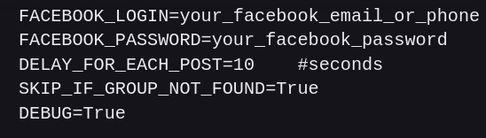
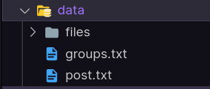
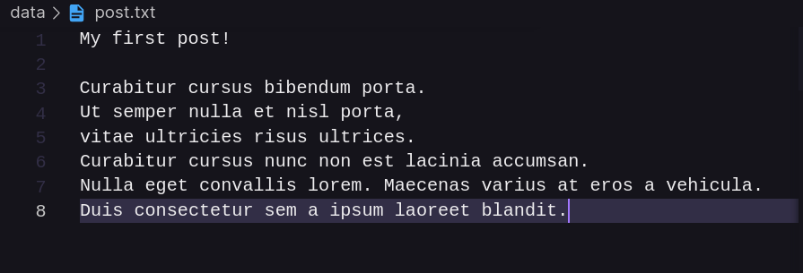
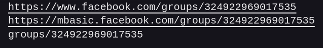
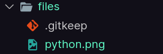
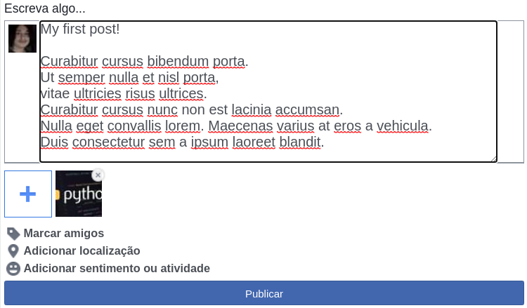

# **Auto Posting In Facebook Groups in Python**

---
## - **About:**

I was trying to do freelancing with photo edit, nothing professional, just a casual edit for Instagram per example.

So i decide to share my job in Facebook, but was so bad running in every group, write and selecting the same images every time

It was there, that i decide to create this code, a very simple usage of Selenium for automate this boring task.

I used [mbasic.facebook](https://mbasic.facebook.com) to do this, it's a old facebook version, the normal Facebook version is a SPA (Single Page Application), SPA's are rendering on front-end, the CSS classes's and id's names doesn't make any sense, making automation libraries ~~(and my)~~ life's hard. Is not impossible to do this in normal Facebook, but it's a little bit harder, so, let's continue making things simple.

**This is a very junior code, project's organization is not the best. I will try to grow-up this in the future, when my knowledge in Python evolve**

---

## - **How It Works:**

First of all, you have to has **Google Chrome** installed in your computer, if you doesn't, just **[Download Here](https://www.google.com/intl/us-ENG/chrome/)**

### **Ok, Let's Begin**

---

Clone this repository in our local machine with:

`git clone https://github.com/FerFR/auto_post_facebook_group.git`

Access the folder with:

`cd auto_post_facebook_group`

Now, open with your favorite IDE, in this case i will be using [**Visual Studio Code**](https://code.visualstudio.com/):

`code .`

---

The project structure:

Install project's dependencies on **requirements.txt**:

`pip install -r requirements.txt`

*This requirements.txt contains all projects dependencies, is very common to see this on most Python projects*

Now, how have to rename this **.env.example** file for **.env**

`cp .env.example .env`

In this file, in will see some environment variables:

- **FACEBOOK_LOGIN** = You will put your Facebook login
- **FACEBOOK_PASSWORD** = You will put your Facebook password
- **DELAY_FOR_EACH_POST** = It's a time to wait on every post completed in seconds
- **SKIP_IF_GROUP_NOT_FOUND** = If page not found, will continue for the next group link
- **DEBUG** = If debug is equal True, the post will not occour

*.env means environment file, on this file, will have all of your config and sensitive data about your project, like password, api-keys, and more. This is usefull for easily setup your development and production environment, not needing hard-core all this data again.*

---

This is most importanting folder:

- On **files** folder, will contain the imagens, videos, or gifs what you want to attach
- **post.txt** will contain your post text content
- **groups.txt** will be list of links of all groups you want to make a post

### **post.txt**:

*You can write on Facebook, with emojis, and copy and paste here*

### **groups.txt**:

*This is only three supported url format*

### **files**:

*Will contain just a image for example*

---

## **This is the result:**

