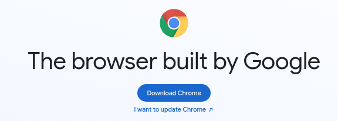

# **Auto Posting In Facebook Groups in Python**

---
## - **About:**

I was trying to do freelancing with photo edit, nothing professional, just a casual edit for Instagram per example.

So i decide to share my job in Facebook, but was so bad running in every group, write and selecting the same images every time

It was there, that i decide to create this code, a very simple usage of Selenium for automate this boring task.

I used [mbasic.facebook](https://mbasic.facebook.com) to do this, it's a old facebook version, the normal Facebook version is a SPA (Single Page Application), SPA's are rendering on front-end, the CSS classes's and id's names doesn't make any sense, making automation libraries ~~(and my)~~ life's hard. Is not impossible to do this in normal Facebook, but it's a little bit harder, so, let's continue making things simple.

**This is a very junior code, project's organization is not the best. I will try to grow-up this in the future, when my knowledge in Python evolve**

---

## - **How It Works:**

First of all, you have to has **Google Chrome** installed in your computer, if you doesn't, just **[Download Here](https://www.google.com/intl/us-ENG/chrome/)**

### **Ok, Let's Begin**

---

Clone this repository in our local machine with:

`git clone https://github.com/FerFR/auto_post_facebook_group.git`

Access the folder with:

`cd auto_post_facebook_group`

Now open with your favorite IDE, in this case i will be using [**Visual Studio Code**](https://code.visualstudio.com/):

`code .`

